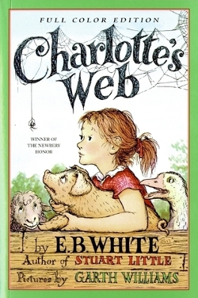

Author: E.B. White

**“Trust me, Wilbur. People are very gullible. They'll believe anything they see in print.”**

― E.B. White, Charlotte's Web

 


## Summary
*Some Pig. Humble. Radiant.* These are the words in Charlotte's Web, high up in Zuckerman's barn. Charlotte's spiderweb tells of her feelings for a little pig named Wilbur, who simply wants a friend. They also express the love of a girl named Fern, who saved Wilbur's life when he was born the runt of his litter.

E. B. White's Newbery Honor Book is a tender novel of friendship, love, life, and death that will continue to be enjoyed by generations to come. It contains illustrations by Garth Williams, the acclaimed illustrator of E.B. White's Stuart Little and Laura Ingalls Wilder's Little House series, among many other books.

```{r thewordcloud, results='hide', echo=FALSE, message=FALSE, warning=FALSE}
##### EDIT SEARCH PARAMETERS BELOW
search_term <- "Charlotte's Web"  # For two terms use e.g. "Queen+Tearling"
# For hashtags use e.g. "#Charlotte's Web"
language <- "en"
sample_size <- 3200
AU_geocode <- '38.9375300,-77.0868600,10mi'  # Latitude, Longitude, Radius
# Here specifies 10 miles from AU campus
since <- '2016-10-08'  # Election Day
until <- '2016-11-08'  # INSERT Until Date, not used here
##### EDIT SEARCH PARAMETERS ABOVE

source('~/Documents/Spring2017/Books/Books/TwitterAuth.R')

library(twitteR)
library(tm)
library(wordcloud)
library(RColorBrewer)
library(twitteR)

####### EDIT THE NEXT LINE TO SPECIFY SEARCH
tweets_raw = searchTwitter(search_term,
                           n=sample_size,
                           #geocode=AU_geocode,
                           #since=since,
                           #until=until,
                           lang=language)
####### EDIT THE PREVIOUS LINE TO SPECIFY SEARCH

# NEXT TWO LINES REMOVES META-DATA THEN CONVERTS DATA TO A NEEDED FORMAT
tweets_text = sapply(tweets_raw, function(x) x$getText())
tweets_corpus = Corpus(VectorSource(tweets_text))

# NEXT LINE REMOVES SPECIAL CHARACTERS AVAILABLE IN OTHER LANGUAGES
tweets_transformed1 <- tm_map(tweets_corpus,
                              content_transformer(function(x) iconv(x, to="UTF-8-MAC")),
                              mc.cores=1)

# NEXT LINE CONVERTS EVERYTHING TO LOWER CASE
tweets_transformed2 <- tm_map(tweets_transformed1,
                              content_transformer(tolower),
                              mc.cores=1)
# NEXT LINE REMOVES PUNCTUATION
tweets_transformed3 <- tm_map(tweets_transformed2,
                              removePunctuation,
                              mc.cores=1)
# NEXT LINE REMOVES "STOPWORDS" LIKE "THE", "AN", "IS", "BE", ETC.
tweets_transformed4 <- tm_map(tweets_transformed3,
                              function(x) removeWords(x,stopwords()),
                              mc.cores=1)
# NEXT LINE REMOVES words starting with "https"
tweets_transformed5 <- tm_map(tweets_transformed4,
                              function(x) removeWords(x,"http[^[:space:]]*"),mc.cores=1)


###### EDIT NEXT LINE TO SPECIFY DRAWING OF WORD CLOUD
wordcloud(tweets_transformed5, random.order=FALSE, colors=brewer.pal(8,"Dark2"))
```

``` {r Tweets, message=FALSE, warning=FALSE, echo=FALSE, error=FALSE}

# Run Twitter Search

tweets <- searchTwitter("Charlotte's Web", n=3200, lang="en")

for(i in 1:20){
  print(tweets[[i]])
}
```

```{r tweet map, message=FALSE, echo=FALSE, warning=FALSE}
# 
# tweets.df <- do.call("rbind",lapply(tweets,as.data.frame))
# 
# sum(is.na(tweets.df$latitude)<490){
#   install.packages("maps", repos = "http://cran.us.r-project.org")
#   library(maps)
#   #plots worldmap
#   map('world')
#   #plots tweets
#   points(tweets.df$longitude,tweets.df$latitude, pch=20, cex=1, col="blue")
# }
```

```

##Key Themes
* bookstomovies
* classics

##Extras
* Time's "100 Best Young Adult Books of All Time"   
* Newbery Honor   
* Oklahoma Sequoyah Book Award   
* Laura Ingalls Wilder Award (1970)   

***
<small> <small>  

summary from Goodreads 

extras from Barnes & Noble

\small \small