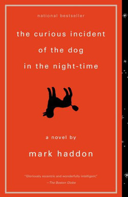

Author: Mark Haddon

**“Also, dogs are faithful and they do not tell lies because they cannot talk.”**

― Mark Haddon, The Curious Incident of the Dog in the Night-Time




## Summary
Christopher John Francis Boone knows all the countries of the world and their capitals and every prime number up to 7,057. He relates well to animals but has no understanding of human emotions. He cannot stand to be touched. And he detests the color yellow.

Although gifted with a superbly logical brain, for fifteen-year-old Christopher everyday interactions and admonishments have little meaning. He lives on patterns, rules, and a diagram kept in his pocket. Then one day, a neighbor's dog, Wellington, is killed and his carefully constructive universe is threatened. Christopher sets out to solve the murder in the style of his favourite (logical) detective, Sherlock Holmes. What follows makes for a novel that is funny, poignant and fascinating in its portrayal of a person whose curse and blessing are a mind that perceives the world entirely literally.

```{r thewordcloud, results='hide', echo=FALSE, message=FALSE, warning=FALSE, error=FALSE}
##### EDIT SEARCH PARAMETERS BELOW
search_term <- "The Curious Incident of the Dog in the Night-Time+curious incident"  # For two terms use e.g. "eleanor+park"
# For hashtags use e.g. "#eleanor+park"
language <- "en"
sample_size <- 3200 
AU_geocode <- '38.9375300,-77.0868600,10mi'  # Latitude, Longitude, Radius
# Here specifies 10 miles from AU campus
since <- '2016-10-08'  # Election Day
until <- '2016-11-08'  # INSERT Until Date, not used here
##### EDIT SEARCH PARAMETERS ABOVE

source('~/Documents/Spring2017/Books/Books/TwitterAuth.R')

library(twitteR)
library(tm)
library(wordcloud)
library(RColorBrewer)
library(twitteR)

####### EDIT THE NEXT LINE TO SPECIFY SEARCH
tweets_raw = searchTwitter(search_term,
                           n=sample_size,
                           #geocode=AU_geocode,
                           #since=since,
                           #until=until,
                           lang=language)
####### EDIT THE PREVIOUS LINE TO SPECIFY SEARCH

# NEXT TWO LINES REMOVES META-DATA THEN CONVERTS DATA TO A NEEDED FORMAT
tweets_text = sapply(tweets_raw, function(x) x$getText())
tweets_corpus = Corpus(VectorSource(tweets_text))

# NEXT LINE REMOVES SPECIAL CHARACTERS AVAILABLE IN OTHER LANGUAGES
tweets_transformed1 <- tm_map(tweets_corpus,
                              content_transformer(function(x) iconv(x, to="UTF-8-MAC")),
                              mc.cores=1)

# NEXT LINE CONVERTS EVERYTHING TO LOWER CASE
tweets_transformed2 <- tm_map(tweets_transformed1,
                              content_transformer(tolower),
                              mc.cores=1)
# NEXT LINE REMOVES PUNCTUATION
tweets_transformed3 <- tm_map(tweets_transformed2,
                              removePunctuation,
                              mc.cores=1)
# NEXT LINE REMOVES "STOPWORDS" LIKE "THE", "AN", "IS", "BE", ETC.
tweets_transformed4 <- tm_map(tweets_transformed3,
                              function(x) removeWords(x,stopwords()),
                              mc.cores=1)
# NEXT LINE REMOVES words starting with "https"
tweets_transformed5 <- tm_map(tweets_transformed4,
                              function(x) removeWords(x,"http[^[:space:]]*"),mc.cores=1)


###### EDIT NEXT LINE TO SPECIFY DRAWING OF WORD CLOUD
wordcloud(tweets_transformed5, random.order=FALSE, colors=brewer.pal(8,"Dark2"))
```


``` {r Tweets, message=FALSE, warning=FALSE, echo=FALSE, error=FALSE}

# Run Twitter Search

tweets <- searchTwitter("The Curious Incident of the Dog in the Night-Time+curious incident", n=3200, lang="en")

for(i in 1:20){
  print(tweets[[i]])
}
```

```{r tweet map, message=FALSE, echo=FALSE, warning=FALSE}
tweets.df <- do.call("rbind",lapply(tweets,as.data.frame))


install.packages("maps", repos = "http://cran.us.r-project.org")
library(maps)
#plots worldmap
map('world')
#plots tweets
points(tweets.df$longitude,tweets.df$latitude, pch=20, cex=1, col="red")
```


##Key Themes
* autism
* outcasts

##Extras
* 2001-2010 Guardian Children's Fiction Prize    
* Winners2001-2010 Winner - Garden State Teen Book Awards - Fiction Grades 9-12    
* 2003 Carnegie Medal Shortlist    
* 2003 Los Angeles Times Book Prize Winners    
* 2003 Whitbread Book Award Winners    
* 2004 Alex Awards    
* 2005-2006 Texas Tayshas Reading List
* Los Angeles Times Book Prize for First Fiction (Art Seidenbaum Award)    
* New York Public Library's 25 Books to Remember for 2003    
* New York Times Notable Fiction & Poetry of 2003    
* Novel->Costa/Whitbread Book Award    
* Publishers Weekly's Best Fiction of 2003     
* Strife - FictionUS News & World Report Favorite Books of 2003    
* Village Voice Best Books of the Year 2003     
* Washington Post's Best Fiction of 2003

***
<small> <small>  

summary from Goodreads 

extras from Barnes & Noble

\small \small