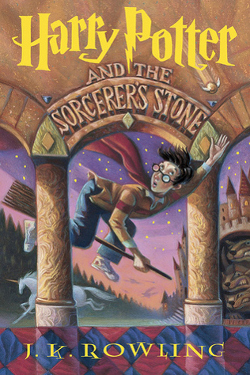

Author: J.K. Rowling

**“But you know, happiness can be found even in the darkest of times, if one only remembers to turn on the light.”**

― J.K. Rowling, Harry Potter and the Prisoner of Azkaban




## Summary
Harry Potter's life is miserable. His parents are dead and he's stuck with his heartless relatives, who force him to live in a tiny closet under the stairs. But his fortune changes when he receives a letter that tells him the truth about himself: he's a wizard. A mysterious visitor rescues him from his relatives and takes him to his new home, Hogwarts School of Witchcraft and Wizardry.

After a lifetime of bottling up his magical powers, Harry finally feels like a normal kid. But even within the Wizarding community, he is special. He is the boy who lived: the only person to have ever survived a killing curse inflicted by the evil Lord Voldemort, who launched a brutal takeover of the Wizarding world, only to vanish after failing to kill Harry.

Though Harry's first year at Hogwarts is the best of his life, not everything is perfect. There is a dangerous secret object hidden within the castle walls, and Harry believes it's his responsibility to prevent it from falling into evil hands. But doing so will bring him into contact with forces more terrifying than he ever could have imagined.

Full of sympathetic characters, wildly imaginative situations, and countless exciting details, the first installment in the series assembles an unforgettable magical world and sets the stage for many high-stakes adventures to come.

```{r Twitter Auto, results='hide', echo=FALSE, message=FALSE, warning=FALSE, error=FALSE}

source('~/Documents/Spring2017/Books/Books/TwitterAuth.R')
```


```{r thewordcloud, results='hide', echo=FALSE, message=FALSE, warning=FALSE, error=FALSE}
##### EDIT SEARCH PARAMETERS BELOW
search_term <- "Harry Potter" 
language <- "en"
sample_size <- 3200
AU_geocode <- '38.9375300,-77.0868600,10mi'  # Latitude, Longitude, Radius
# Here specifies 10 miles from AU campus
since <- '2016-10-08'  # Election Day
until <- '2016-11-08'  # INSERT Until Date, not used here
##### EDIT SEARCH PARAMETERS ABOVE

# NEXT 4 LINES LOAD LIBRARIES OF FUNCTIONS

library(tm)
library(wordcloud)
library(RColorBrewer)


####### EDIT THE NEXT LINE TO SPECIFY SEARCH
tweets_raw = searchTwitter(search_term,
                           n=sample_size,
                           #geocode=AU_geocode,
                           #since=since,
                           #until=until,
                           lang=language)
####### EDIT THE PREVIOUS LINE TO SPECIFY SEARCH

# NEXT TWO LINES REMOVES META-DATA THEN CONVERTS DATA TO A NEEDED FORMAT
tweets_text = sapply(tweets_raw, function(x) x$getText())
tweets_corpus = Corpus(VectorSource(tweets_text))

# NEXT LINE REMOVES SPECIAL CHARACTERS AVAILABLE IN OTHER LANGUAGES
tweets_transformed1 <- tm_map(tweets_corpus,
                              content_transformer(function(x) iconv(x, to="UTF-8-MAC")), mc.cores=1)

# NEXT LINE CONVERTS EVERYTHING TO LOWER CASE
tweets_transformed2 <- tm_map(tweets_transformed1,
                              content_transformer(tolower), mc.cores=1)
# NEXT LINE REMOVES PUNCTUATION
tweets_transformed3 <- tm_map(tweets_transformed2,
                              removePunctuation, mc.cores=1)
# NEXT LINE REMOVES "STOPWORDS" LIKE "THE", "AN", "IS", "BE", ETC.
tweets_transformed4 <- tm_map(tweets_transformed3,
                              function(x) removeWords(x,stopwords()), mc.cores=1)
# NEXT LINE REMOVES words starting with "https"
tweets_transformed5 <- tm_map(tweets_transformed4,
                              function(x) removeWords(x,"http[^[:space:]]*"), mc.cores=1)


###### EDIT NEXT LINE TO SPECIFY DRAWING OF WORD CLOUD
wordcloud(tweets_transformed5, random.order=FALSE, colors=brewer.pal(8,"Dark2"))
```


``` {r Tweets, message=FALSE, echo=FALSE, warning=FALSE}

# Run Twitter Search

tweets <- searchTwitter("Harry Potter", n=3200, lang="en")

for(i in 1:20){
  print(tweets[[i]])
}
```

```{r tweet map, message=FALSE, echo=FALSE, warning=FALSE}
tweets.df <- do.call("rbind",lapply(tweets,as.data.frame))


install.packages("maps", repos = "http://cran.us.r-project.org")
library(maps)
#plots worldmap
map('world')
#plots tweets
points(tweets.df$longitude,tweets.df$latitude, pch=20, cex=1, col="red")
```


##Key Themes
* orphan
* magic
* bookstomovies

***
<small> <small>  

summary from Goodreads 

\small \small