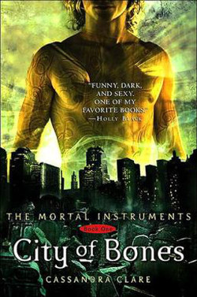

```{r setup, include=FALSE}
knitr::opts_chunk$set(echo = TRUE)
```
Author: Cassandra Clare

**“Sarcasm is the last refuge of the imaginatively bankrupt.”**

― Cassandra Clare, City of Bones



## Summary
When fifteen-year-old Clary Fray heads out to the Pandemonium Club in New York City, she hardly expects to witness a murder― much less a murder committed by three teenagers covered with strange tattoos and brandishing bizarre weapons. Then the body disappears into thin air. It's hard to call the police when the murderers are invisible to everyone else and when there is nothing―not even a smear of blood―to show that a boy has died. Or was he a boy?

This is Clary's first meeting with the Shadowhunters, warriors dedicated to ridding the earth of demons. It's also her first encounter with Jace, a Shadowhunter who looks a little like an angel and acts a lot like a jerk. Within twenty-four hours Clary is pulled into Jace's world with a vengeance, when her mother disappears and Clary herself is attacked by a demon. But why would demons be interested in ordinary mundanes like Clary and her mother? And how did Clary suddenly get the Sight? The Shadowhunters would like to know... 

Exotic and gritty, exhilarating and utterly gripping, Cassandra Clare's ferociously entertaining fantasy takes readers on a wild ride that they will never want to end.

```{r thewordcloud, results='hide', echo=FALSE, message=FALSE, warning=FALSE}
##### EDIT SEARCH PARAMETERS BELOW
search_term <- "City of Bones"
language <- "en"
sample_size <- 3200 
AU_geocode <- '38.9375300,-77.0868600,10mi'  # Latitude, Longitude, Radius
# Here specifies 10 miles from AU campus
since <- '2016-10-08'  # Election Day
until <- '2016-11-08'  # INSERT Until Date, not used here
##### EDIT SEARCH PARAMETERS ABOVE

# NEXT 4 LINES LOAD LIBRARIES OF FUNCTIONS
consumer_key <- "qOvNAzHxL7i8R1AajYJZumw5M"
consumer_secret <- "1ETLwgpE6IKi8LW96Isp2wXuKFRDZSJ2F6tnRi2UWq29wAcaYt"
access_token <- "3011251745-xO3ltw0KN0WEyMMEvFTGqt04QTD3RILdcg91I4L"
access_secret <- "KrSa45CHZFSVUgUyFAnfkBYEQBJ8JX26A0ytTQ4r3atz9"

library(twitteR)
setup_twitter_oauth(consumer_key,consumer_secret,access_token,access_secret)
library(tm)
library(wordcloud)
library(RColorBrewer)
library(twitteR)

####### EDIT THE NEXT LINE TO SPECIFY SEARCH
tweets_raw = searchTwitter(search_term,
                           n=sample_size,
                           #geocode=AU_geocode,
                           #since=since,
                           #until=until,
                           lang=language)
####### EDIT THE PREVIOUS LINE TO SPECIFY SEARCH

# NEXT TWO LINES REMOVES META-DATA THEN CONVERTS DATA TO A NEEDED FORMAT
tweets_text = sapply(tweets_raw, function(x) x$getText())
tweets_corpus = Corpus(VectorSource(tweets_text))

# NEXT LINE REMOVES SPECIAL CHARACTERS AVAILABLE IN OTHER LANGUAGES
tweets_transformed1 <- tm_map(tweets_corpus,
                              content_transformer(function(x) iconv(x, to="UTF-8-MAC")),
                              mc.cores=1)

# NEXT LINE CONVERTS EVERYTHING TO LOWER CASE
tweets_transformed2 <- tm_map(tweets_transformed1,
                              content_transformer(tolower),
                              mc.cores=1)
# NEXT LINE REMOVES PUNCTUATION
tweets_transformed3 <- tm_map(tweets_transformed2,
                              removePunctuation,
                              mc.cores=1)
# NEXT LINE REMOVES "STOPWORDS" LIKE "THE", "AN", "IS", "BE", ETC.
tweets_transformed4 <- tm_map(tweets_transformed3,
                              function(x) removeWords(x,stopwords()),
                              mc.cores=1)
# NEXT LINE REMOVES words starting with "https"
tweets_transformed5 <- tm_map(tweets_transformed4,
                              function(x) removeWords(x,"http[^[:space:]]*"),mc.cores=1)


###### EDIT NEXT LINE TO SPECIFY DRAWING OF WORD CLOUD
wordcloud(tweets_transformed5, random.order=FALSE, colors=brewer.pal(8,"Dark2"))
```


``` {r Tweets, message='false', warning=FALSE, echo=FALSE}

# Run Twitter Search

tweets <- searchTwitter("City of Bones", n=500, lang="en")

head(tweets, 20)
```


##Key Themes
* fightingdemons
* urban
* bookstomovies

##Where to Buy
https://www.amazon.com/Bones-Mortal-Instruments-Cassandra-Clare/dp/1481455923

http://www.barnesandnoble.com/w/city-of-bones-cassandra-clare/1100329400

***
<small> <small>  

summary from Goodreads 

\small \small