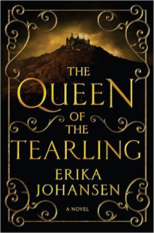

```{r setup, include=FALSE}
knitr::opts_chunk$set(echo = TRUE)
```
Author: Erika Johansen
**“You think of beauty only as a blessing, Majesty, but it brings its own punishments.”**

― Erika Johansen, Queen of the Tearling



## Summary
An untested young princess must claim her throne, learn to become a queen, and combat a malevolent sorceress in an epic battle between light and darkness in this spectacular debut—the first novel in a trilogy.

Young Kelsea Raleigh was raised in hiding after the death of her mother, Queen Elyssa, far from the intrigues of the royal Keep and in the care of two devoted servants who pledged their lives to protect her. Growing up in a cottage deep in the woods, Kelsea knows little of her kingdom's haunted past . . . or that its fate will soon rest in her hands.

Long ago, Kelsea's forefathers sailed away from a decaying world to establish a new land free of modern technology. Three hundred years later, this feudal society has divided into three fearful nations who pay duties to a fourth: the powerful Mortmesne, ruled by the cunning Red Queen. Now, on Kelsea's nineteenth birthday, the tattered remnants of the Queen's Guard—loyal soldiers who protect the throne—have appeared to escort the princess on a perilous journey to the capital to ascend to her rightful place as the new Queen of the Tearling.

Though born of royal blood and in possession of the Tear sapphire, a jewel of immense power and magic, Kelsea has never felt more uncertain of her ability to rule. But the shocking evil she discovers in the heart of her realm will precipitate an act of immense daring, throwing the entire kingdom into turmoil—and unleashing the Red Queen's vengeance. A cabal of enemies with an array of deadly weapons, from crimson-caped assassins to the darkest blood magic, plots to destroy her. But Kelsea is growing in strength and stealth, her steely resolve earning her loyal allies, including the Queen's Guard, led by the enigmatic Lazarus, and the intriguing outlaw known simply as "the Fetch."

Kelsea's quest to save her kingdom and meet her destiny has only just begun. Riddled with mysteries, betrayals, and treacherous battles, Kelsea's journey is a trial by fire that will either forge a legend . . . or destroy her.

```{r thewordcloud, results='hide', echo=FALSE, message=FALSE, warning=FALSE}
##### EDIT SEARCH PARAMETERS BELOW
search_term <- "Queen+Tearling"  # For two terms use e.g. "Queen+Tearling"
# For hashtags use e.g. "#Queen+Tearling"
language <- "en"
sample_size <- 3200
AU_geocode <- '38.9375300,-77.0868600,10mi'  # Latitude, Longitude, Radius
# Here specifies 10 miles from AU campus
since <- '2016-10-08'  # Election Day
until <- '2016-11-08'  # INSERT Until Date, not used here
##### EDIT SEARCH PARAMETERS ABOVE

source('~/Documents/Spring2017/Books/Books/TwitterAuth.R')

library(twitteR)
library(tm)
library(wordcloud)
library(RColorBrewer)
library(twitteR)

####### EDIT THE NEXT LINE TO SPECIFY SEARCH
tweets_raw = searchTwitter(search_term,
                           n=sample_size,
                           #geocode=AU_geocode,
                           #since=since,
                           #until=until,
                           lang=language)
####### EDIT THE PREVIOUS LINE TO SPECIFY SEARCH

# NEXT TWO LINES REMOVES META-DATA THEN CONVERTS DATA TO A NEEDED FORMAT
tweets_text = sapply(tweets_raw, function(x) x$getText())
tweets_corpus = Corpus(VectorSource(tweets_text))

# NEXT LINE REMOVES SPECIAL CHARACTERS AVAILABLE IN OTHER LANGUAGES
tweets_transformed1 <- tm_map(tweets_corpus,
                              content_transformer(function(x) iconv(x, to="UTF-8-MAC")),
                              mc.cores=1)

# NEXT LINE CONVERTS EVERYTHING TO LOWER CASE
tweets_transformed2 <- tm_map(tweets_transformed1,
                              content_transformer(tolower),
                              mc.cores=1)
# NEXT LINE REMOVES PUNCTUATION
tweets_transformed3 <- tm_map(tweets_transformed2,
                              removePunctuation,
                              mc.cores=1)
# NEXT LINE REMOVES "STOPWORDS" LIKE "THE", "AN", "IS", "BE", ETC.
tweets_transformed4 <- tm_map(tweets_transformed3,
                              function(x) removeWords(x,stopwords()),
                              mc.cores=1)
# NEXT LINE REMOVES words starting with "https"
tweets_transformed5 <- tm_map(tweets_transformed4,
                              function(x) removeWords(x,"http[^[:space:]]*"),mc.cores=1)


###### EDIT NEXT LINE TO SPECIFY DRAWING OF WORD CLOUD
wordcloud(tweets_transformed5, random.order=FALSE, colors=brewer.pal(8,"Dark2"))
```

``` {r Tweets, message=FALSE, warning=FALSE, echo=FALSE, error=FALSE}

# Run Twitter Search

tweets <- searchTwitter("Queen+Tearling", n=3200, lang="en")

for(i in 1:20){
  print(tweets[[i]])
}
```

##Key Themes
* bookstomovies
* crossworlds
* strongfemaleleads

##Extras
* A #1 Indie Next Pick
* A LibraryReads Selection
* Emma Watson is rumored to play Kelsea in a future movie adaptation

***
<small> <small>  

summary from Goodreads 

extras from Barnes & Noble

\small \small