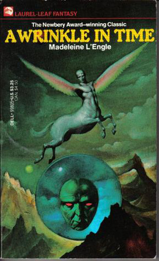

Author: Madeleine L'Engle

**“If you aren't unhappy sometimes you don't know how to be happy.”**

― Madeleine L'Engle, A Wrinkle in Time




## Summary
It was a dark and stormy night; Meg Murry, her small brother Charles Wallace, and her mother had come down to the kitchen for a midnight snack when they were upset by the arrival of a most disturbing stranger. 

"Wild nights are my glory," the unearthly stranger told them. "I just got caught in a downdraft and blown off course. Let me be on my way. Speaking of way, by the way, there is such a thing as a tesseract".

Meg's father had been experimenting with this fifth dimension of time travel when he mysteriously disappeared. Now the time has come for Meg, her friend Calvin, and Charles Wallace to rescue him. But can they outwit the forces of evil they will encounter on their heart-stopping journey through space?

```{r thewordcloud, results='hide', echo=FALSE, message=FALSE, warning=FALSE}
##### EDIT SEARCH PARAMETERS BELOW
search_term <- "A Wrinkle in Time"  # For two terms use e.g. "Queen+Tearling"
# For hashtags use e.g. "#A Wrinkle in Time"
language <- "en"
sample_size <- 3200
AU_geocode <- '38.9375300,-77.0868600,10mi'  # Latitude, Longitude, Radius
# Here specifies 10 miles from AU campus
since <- '2016-10-08'  # Election Day
until <- '2016-11-08'  # INSERT Until Date, not used here
##### EDIT SEARCH PARAMETERS ABOVE

source('~/Documents/Spring2017/Books/Books/TwitterAuth.R')

library(twitteR)
library(tm)
library(wordcloud)
library(RColorBrewer)
library(twitteR)

####### EDIT THE NEXT LINE TO SPECIFY SEARCH
tweets_raw = searchTwitter(search_term,
                           n=sample_size,
                           #geocode=AU_geocode,
                           #since=since,
                           #until=until,
                           lang=language)
####### EDIT THE PREVIOUS LINE TO SPECIFY SEARCH

# NEXT TWO LINES REMOVES META-DATA THEN CONVERTS DATA TO A NEEDED FORMAT
tweets_text = sapply(tweets_raw, function(x) x$getText())
tweets_corpus = Corpus(VectorSource(tweets_text))

# NEXT LINE REMOVES SPECIAL CHARACTERS AVAILABLE IN OTHER LANGUAGES
tweets_transformed1 <- tm_map(tweets_corpus,
                              content_transformer(function(x) iconv(x, to="UTF-8-MAC")),
                              mc.cores=1)

# NEXT LINE CONVERTS EVERYTHING TO LOWER CASE
tweets_transformed2 <- tm_map(tweets_transformed1,
                              content_transformer(tolower),
                              mc.cores=1)
# NEXT LINE REMOVES PUNCTUATION
tweets_transformed3 <- tm_map(tweets_transformed2,
                              removePunctuation,
                              mc.cores=1)
# NEXT LINE REMOVES "STOPWORDS" LIKE "THE", "AN", "IS", "BE", ETC.
tweets_transformed4 <- tm_map(tweets_transformed3,
                              function(x) removeWords(x,stopwords()),
                              mc.cores=1)
# NEXT LINE REMOVES words starting with "https"
tweets_transformed5 <- tm_map(tweets_transformed4,
                              function(x) removeWords(x,"http[^[:space:]]*"),mc.cores=1)


###### EDIT NEXT LINE TO SPECIFY DRAWING OF WORD CLOUD
wordcloud(tweets_transformed5, random.order=FALSE, colors=brewer.pal(8,"Dark2"))
```

``` {r Tweets, message=FALSE, warning=FALSE, echo=FALSE, error=FALSE, eval=FALSE}

# Run Twitter Search

tweets <- searchTwitter("A Wrinkle in Time", n=3200, lang="en")

for(i in 1:20){
  print(tweets[[i]])
}
```

```{r tweet map, message=FALSE, echo=FALSE, warning=FALSE, eval=FALSE}
tweets.df <- do.call("rbind",lapply(tweets,as.data.frame))


install.packages("maps", repos = "http://cran.us.r-project.org")
library(maps)
#plots worldmap
map('world')
#plots tweets
points(tweets.df$longitude,tweets.df$latitude, pch=20, cex=1, col="red")
```

##Key Themes
* bookstomovies
* crossworlds
* strongfemaleleads
* classic

##Extras
* Newbery Medal   
* Oklahoma Sequoyah Book Award   

***
<small> <small>  

summary from Goodreads 

extras from Barnes & Noble

\small \small