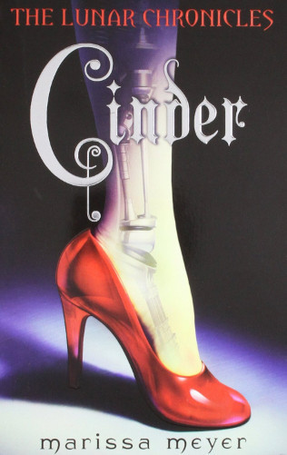

```{r setup, include=FALSE}
knitr::opts_chunk$set(echo = TRUE)
```
Author: Marissa Meyer

**“I'm sure I'll feel much more grateful when I find a guy who thinks complex wiring in a girl is a turn-on.”**

― Marissa Meyer, Cinder



## Summary
Sixteen-year-old Cinder is considered a technological mistake by most of society and a burden by her stepmother. Being cyborg does have its benefits, though: Cinder's brain interference has given her an uncanny ability to fix things (robots, hovers, her own malfunctioning parts), making her the best mechanic in New Beijing. This reputation brings Prince Kai himself to her weekly market booth, needing her to repair a broken android before the annual ball. He jokingly calls it "a matter of national security," but Cinder suspects it's more serious than he's letting on.

Although eager to impress the prince, Cinder's intentions are derailed when her younger stepsister, and only human friend, is infected with the fatal plague that's been devastating Earth for a decade. Blaming Cinder for her daughter's illness, Cinder's stepmother volunteers her body for plague research, an "honor" that no one has survived.

But it doesn't take long for the scientists to discover something unusual about their new guinea pig. Something others would kill for. 

```{r Twitter Auto, echo=FALSE}
library(twitteR)
library(httr)

consumer_key <- "qOvNAzHxL7i8R1AajYJZumw5M"
consumer_secret <- "1ETLwgpE6IKi8LW96Isp2wXuKFRDZSJ2F6tnRi2UWq29wAcaYt"
access_token <- "3011251745-xO3ltw0KN0WEyMMEvFTGqt04QTD3RILdcg91I4L"
access_secret <- "KrSa45CHZFSVUgUyFAnfkBYEQBJ8JX26A0ytTQ4r3atz9"
setup_twitter_oauth(consumer_key,consumer_secret,access_token,access_secret)
```


```{r thewordcloud, results='hide', echo=FALSE, message=FALSE, echo=FALSE, warning=FALSE}
##### EDIT SEARCH PARAMETERS BELOW
search_term <- "Lunar Chronicles" 
language <- "en"
sample_size <- 3200
AU_geocode <- '38.9375300,-77.0868600,10mi'  # Latitude, Longitude, Radius
# Here specifies 10 miles from AU campus
since <- '2016-10-08'  # Election Day
until <- '2016-11-08'  # INSERT Until Date, not used here
##### EDIT SEARCH PARAMETERS ABOVE

# NEXT 4 LINES LOAD LIBRARIES OF FUNCTIONS

library(tm)
library(wordcloud)
library(RColorBrewer)

####### EDIT THE NEXT LINE TO SPECIFY SEARCH
tweets_raw = searchTwitter(search_term,
                           n=sample_size,
                           #geocode=AU_geocode,
                           #since=since,
                           #until=until,
                           lang=language)
####### EDIT THE PREVIOUS LINE TO SPECIFY SEARCH

# NEXT TWO LINES REMOVES META-DATA THEN CONVERTS DATA TO A NEEDED FORMAT
tweets_text = sapply(tweets_raw, function(x) x$getText())
tweets_corpus = Corpus(VectorSource(tweets_text))

# NEXT LINE REMOVES SPECIAL CHARACTERS AVAILABLE IN OTHER LANGUAGES
tweets_transformed1 <- tm_map(tweets_corpus,
                              content_transformer(function(x) iconv(x, to="UTF-8-MAC")), mc.cores=1)

# NEXT LINE CONVERTS EVERYTHING TO LOWER CASE
tweets_transformed2 <- tm_map(tweets_transformed1,
                              content_transformer(tolower), mc.cores=1)
# NEXT LINE REMOVES PUNCTUATION
tweets_transformed3 <- tm_map(tweets_transformed2,
                              removePunctuation, mc.cores=1)
# NEXT LINE REMOVES "STOPWORDS" LIKE "THE", "AN", "IS", "BE", ETC.
tweets_transformed4 <- tm_map(tweets_transformed3,
                              function(x) removeWords(x,stopwords()), mc.cores=1)
# NEXT LINE REMOVES words starting with "https"
tweets_transformed5 <- tm_map(tweets_transformed4,
                              function(x) removeWords(x,"http[^[:space:]]*"), mc.cores=1)


###### EDIT NEXT LINE TO SPECIFY DRAWING OF WORD CLOUD
wordcloud(tweets_transformed5, random.order=FALSE, colors=brewer.pal(8,"Dark2"))
```


``` {r Tweets, message='false', echo=FALSE, warning=FALSE}

# Run Twitter Search

tweets <- searchTwitter("TheLunarChronicles", n=500, lang="en")

head(tweets, 20)
```


##Key Themes
* cyber
* retoldfairytale
* strongfemalelead

##Extras
* A #1 New York Times Bestselling Series

##Where to Buy
https://www.amazon.com/Cinder-Marissa-Meyer/dp/1250007208

http://www.barnesandnoble.com/w/cinder-marissa-meyer/1100649238

***
<small> <small>  

summary from Goodreads 

extras from Barnes & Noble

\small \small