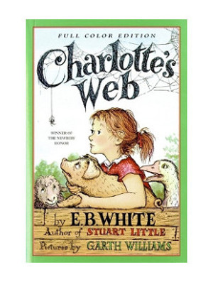
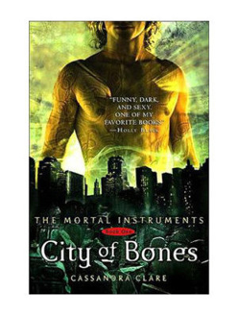
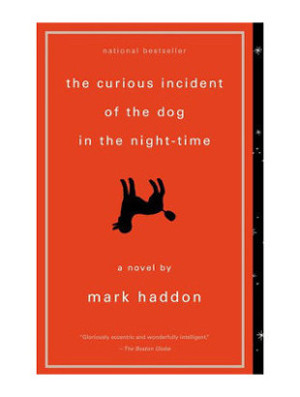

  For many years, stories have been refuges. They have provided a safe escape from the physically and mentally draining challenges of this life.
  
  Since the beginning of time, stories have been a beacon. One of hope and love. The triumphs of the past. The promise of tomorrow.
	
  Life may be difficult, but stories are a way to guide us through. We can imagine how others traverse these depths. We can take courage that others have survived before and will continue to survive. 
	
  Books teach us we are not alone.
	
  “It’s a metaphor” are the famous words that Augustus spoke in *the Fault in Our Stars* by John Green. He explained that by holding the cigarette but not lighting it, he was not giving it power.  
  
  Books are the same. They can heal, raise forgotten pain, or simply transport you away. 
	
  It’s your choice. Decide your metaphor. 
	

***********
      
###Books
**Click on the book cover to view the page**

 

